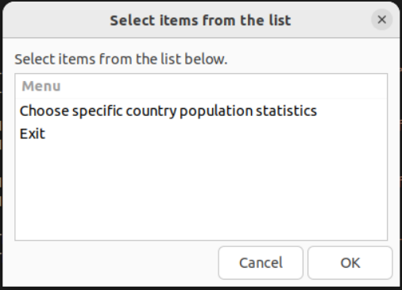
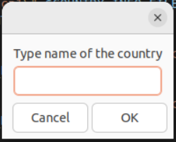
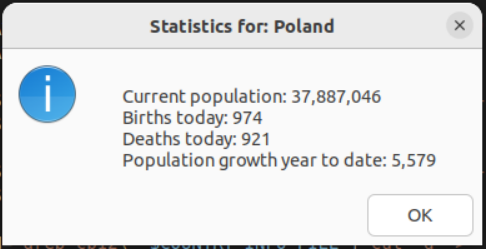

# Country Population Statistics
## Sections

 - [Visuals](#visuals)
 - [Description](#description)
	 - [General](#general)
	 - [Programming languages and libriaries](#programming-languages-and-libraries)
	 - [Main features](#main-features)
 - [Usage](#usage)

## Visuals

  
  

## Description

### General

This bash script allows the user to check live population data for a specific country. The user has to write the country down and then the results show up.
In the database 180+ countries are available. Results include:
 - current population of a country, 
 - daily births,
 - daily deaths,
 - population growth year to date.

### Programming languages

 - Bash

### Main features

- Menu
- Ability to write down a wanted country,
- Population statistics of a country.

## Usage

 - Learning 
